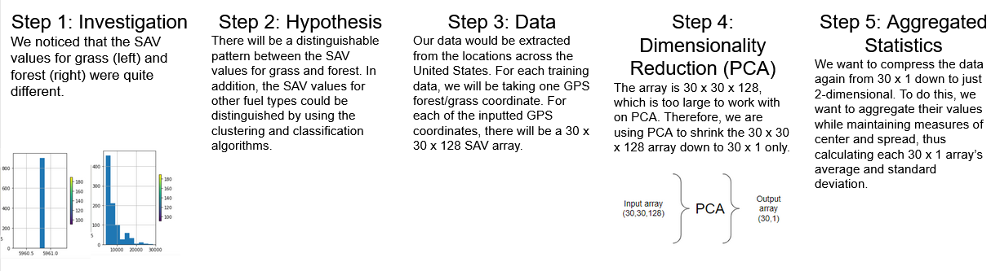
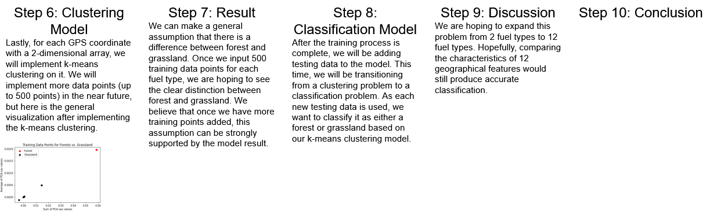

# DSC180 - WIFIRE

### **How to Connect to DSMLP**
- SSH into DSMLP (logs you into home dir in jump box)
  - ssh \<user>@dsmlp-login.ucsd.edu
- Open a pod
  - scipy/ml pod: launch-scipy-ml.sh
  - dockerImage pod: launch.sh -i \<user>/\<image>  (e.g. hmasudat/dsc180_docker)

### **Build Instructions**
- Docker/Pod: launch.sh -i hmasudat/dsc180_docker
- Test: python run.py test
- All: python run.py data features model
- *if there is no raw data, add target "pull"*

### **Targets**
- data: reads raw data
- features: creates features
- model: runs model
- pull: pulls raw data from FastFuels (slow)

### **Pipeline**
Data is pulled from the Fastfuels API and extracted as raw data content. 
PCA dimensionality reduction is performed on the raw data.
These PCA reduced features are then stored as temporary data.
Temporary feature data is then put into a KMeans clustering model where 
it is trained and tested, resulting in an output of predicted data. 

## Abstract

The Congressional Research Services released a report with wildfire statistics, detailing a historical trend in increasing wildfire activity along with the negative impacts they cause. In 2020, 59 wildfires burned over 10 million acres of land, which is a significant increase from previous years. There are a variety of environmental changes that contribute to increasing wildfire impacts, most notably climate change. Due to the warmer and drier conditions combined with long drought periods, the wildfire season durations have increased from four to at least 6 months.

The primary factors to the ignition of wildfires are wind/weather, landscape, and fuel. We define fuel as the composition of matter that a fire can burn and grow with. Some examples of fuel include dead leaves, grass, fallen branches, and essentially any matter in non-urban locations.

Fuel data has traditionally been collected through surveys recurring every two years, in the form of 30 square meter pixels. There are many problems with this source of data collection, including low resolution, outdated data, and high costs. A new synthetic data source titled FastFuels provides data for multiple features in the form of 1 square meter and 128 meter tall voxel columns. The dimensions of FastFuels data offers higher resolution and constant updating which greatly improves the accuracy of information collected. This data is accessible through API calls and comes in the form of a data dictionary with raw values for surface area to volume (sav), moisture, bulk density, and elevation (see Figure 1 (to be added)). Although only the Western half of the United States has been mapped, more FastFuels data is currently being generated by the San Diego Supercomputer Center from a variety of existing features including FIA plots, landfire labels, and fuel type extrapolation.

With this new data source, we can consider different methods to predict and classify fuel types in order to provide accurate insight into proactive fire fighting methods. One proactive wildfire fighting method is using prescribed fires, fires that are safely controlled, to consume built-up fuel. However, this method is most effective with location-based information on fuels in order to mitigate the most risk and damage of wildfires.
Out of the different machine learning classifiers, we believe that a clustering algorithm will perform the best in identifying patterns in the multi-feature data and classifying fuel types. Therefore, our plan for this quarter is to implement a clustering algorithm that can accurately predict the fuel type of each voxel, using a variety of data sources including both FastFuels raw values and LandFire labelling.

### Code

